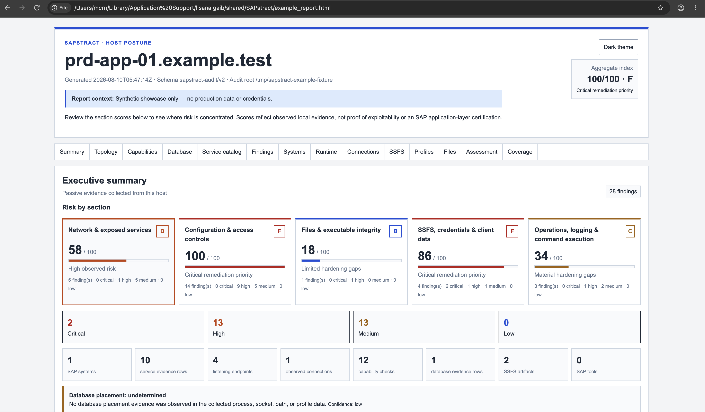
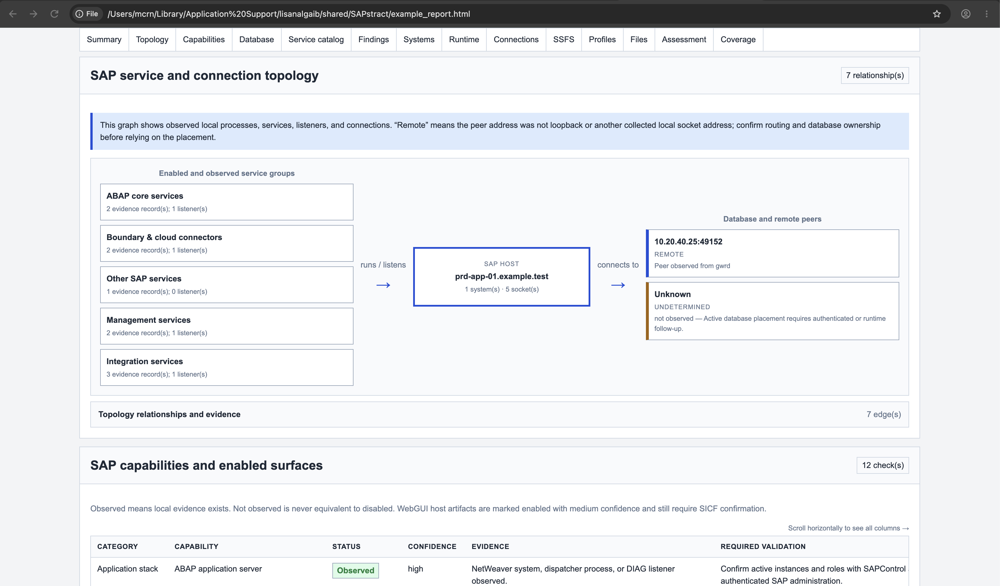
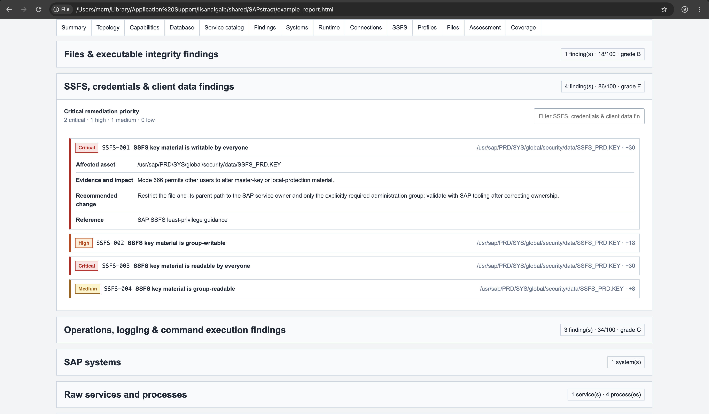

# SAPstract



SAPstract combines two independent SAP security tools:

- read-only host posture collectors for Linux/Unix and Windows; and
- a dependency-free Python library and CLI for SAP Secure Storage in the File System (SSFS).

The collectors discover local SAP systems, services, connections, configuration, permissions, and secure-store metadata. They produce a self-contained HTML report plus JSON evidence. See the synthetic [example HTML report](example_report.html) for a showcase with no production data or credentials.

> **Important:** Treat the report as a footprint, not a metric to get to zero.

## Quick start

Linux/Unix (Bash 4+):

```bash
chmod 750 SAPaudit.sh
sudo ./SAPaudit.sh --output-dir ./reports
```

Windows PowerShell 5.1+ or PowerShell 7+:

```powershell
Set-ExecutionPolicy -Scope Process Bypass
.\SAPaudit.ps1 -OutputDirectory C:\Audit\SAPstract
```

Elevation is recommended for complete process, socket, ACL, and protected-path coverage. Non-elevated runs are supported and record the resulting gaps.

Common options:

| Linux/Unix | PowerShell | Purpose |
|---|---|---|
| `--output-dir DIR` | `-OutputDirectory DIR` | Output directory |
| `--report FILE` | `-ReportPath FILE` | Explicit HTML path |
| `--json FILE` | `-JsonPath FILE` | Explicit JSON path |
| `--root DIR` | `-RootPath DIR` | Mounted/offline filesystem root |
| `--host-label NAME` | `-HostLabel NAME` | Override the reported hostname |
| `--report-note TEXT` | `-ReportNote TEXT` | Add scope or context |
| `--max-files N` | `-MaxFiles N` | Cap broad file scans |
| `--quiet` | `-Quiet` | Suppress normal progress |

Offline example:

```bash
sudo mount -o ro /dev/mapper/sap-root /mnt/sap-root
sudo ./SAPaudit.sh --root /mnt/sap-root --output-dir ./reports/offline
```


## What the report covers

- SAP systems, processes, services, listeners, and observed connections
- Service topology, capabilities, and database-placement evidence
- Security-relevant profiles and SAP ACL files
- Standard paths, ownership, permissions, hashes, and Windows signatures
- SSFS, PSE, Credv2, keystore, transport, trace, and SAP GUI history metadata
- Prioritized findings with evidence, impact, remediation, and references
- Collection coverage and authenticated or active checks still required

Both collectors emit schema `sapstract-audit/v2`. The HTML is self-contained, print-friendly, and supports light/dark themes. JSON keeps the same evidence in stable top-level arrays for automation.

The score is a remediation triage aid, not a probability of compromise or an SAP certification. A report with no findings can still have important coverage gaps.

## Safety boundary

The collectors do not connect to other hosts, call SAP administrative methods, try credentials, exploit vulnerabilities, decrypt secure stores, expose secret values, or change the system. Reports can still contain sensitive topology, usernames, paths, profile values, and hashes; protect them as audit evidence.

For the complete rule and research model, see:

- [Rule catalog](docs/RULE_CATALOG.md)
- [Topology model](docs/TOPOLOGY_MODEL.md)
- [OWASP CBAS coverage](docs/OWASP_CBAS_COVERAGE.md)
- [Security-source gap analysis](docs/SECURITY_SOURCE_GAP_ANALYSIS.md)

---



## Python SSFS package

The separate [`python/`](python/) component is an MIT-licensed Python 3.11+ package for reading, writing, validating, inspecting, and rotating SAP SSFS stores. It does not depend on PySAP, Scapy, or `cryptography`.

Run it from the checkout:

```bash
cd python
PYTHONPATH=src python3 -m sapstract --help
```

Or install it:

```bash
python3 -m pip install ./python
sapstract --version
```

Start with the [package guide](python/README.md), [API reference](python/docs/API.md), and [operations guide](python/docs/OPERATIONS.md). Unlike the passive collectors, this package can return clear bytes and modify stores; use protected inputs, matched backups, and official SAP validation tools.

## Validation

```bash
bash -n SAPaudit.sh
./tests/test-audit-correlation.sh
./SAPaudit.sh --help
```

```powershell
$null = [System.Management.Automation.Language.Parser]::ParseFile(
  (Resolve-Path .\SAPaudit.ps1), [ref]$null, [ref]$parseErrors
)
$parseErrors
.\tests\Test-AuditCorrelation.ps1
```

## License

The host collectors and repository documentation are GPL-3.0; see [LICENSE](LICENSE). The Python SSFS component is MIT-licensed; see [python/LICENSE](python/LICENSE).
